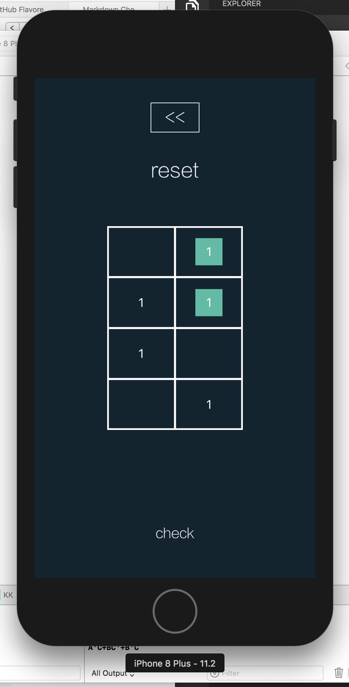
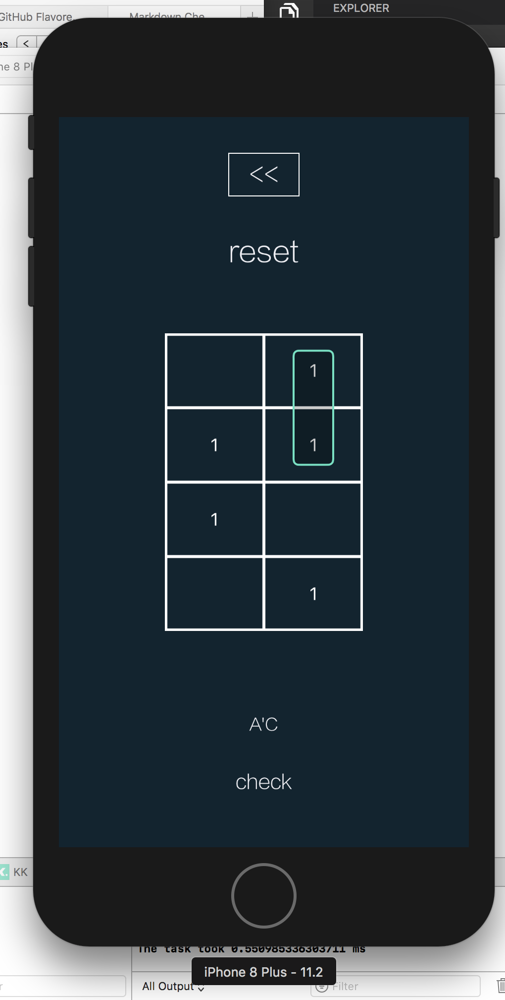
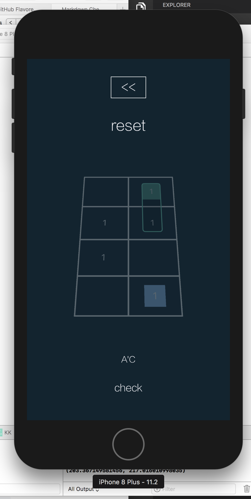
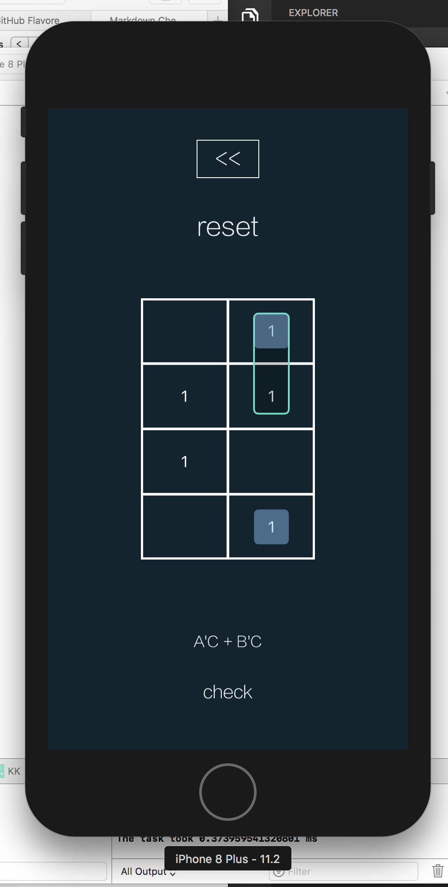
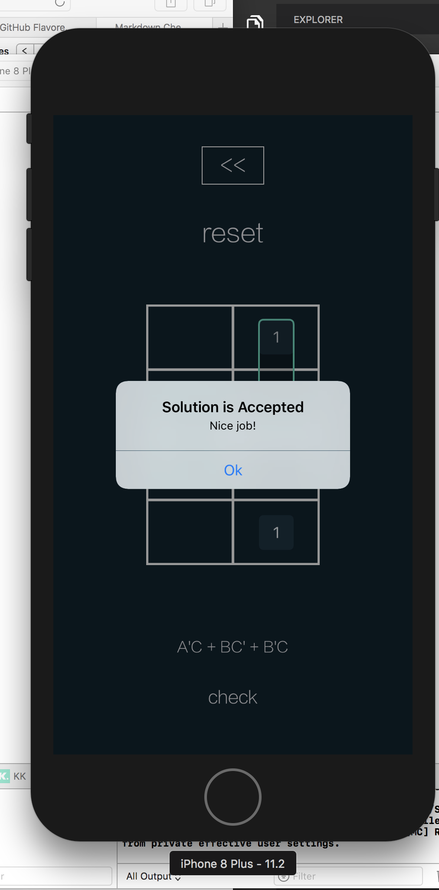

# Karnau
A puzzle game for iOS based on Karnaugh's manual method of simplifying boolean expressions.
An implementation of the Quine-McCluskey simplification algorithm is provided.

## Tutorial
- Install and run on macOS with XCode.app
- Press 'Start'
- Select number of variables, either AB, ABC, ABCD, and a difficulty.
- Tap and drag the mouse to select squares in multiples of two. 
- To wrap around to the other table, tab and drag above or below the square and drag the mouse over the desired sister squares.
- Press 'Check' to validate the solution.








## Install and run on macOS
- Install XCode.app from the App Store
- Open Terminal.app in Applications > Utilities > Terminal.app
- Install Developer Tools by typing gcc and accepting the installation prompts. ```gcc```
- Clone this repository
    ```
    mkdir respositories
    cd repositories
    git clone https://github.com/lexlevi17/karnau
    cd karnau
    ```
- Install [Cocoapods](https://cocoapods.org) with ```sudo gem install cocoapods```
- enter admin password
- Install app dependencies with ```pod install```
- Open './KK.xcworkspace' with XCode.app
- Build with the play button in the upper left hand corner


[logo1]: ./img/img.6.25.11.png "1"
[logo2]: ./img/img.6.25.13.png "2"
[logo3]: ./img/img.6.25.21.png "3"
[logo4]: ./img/img.6.25.24.png "4"
[logo5]: ./img/img.6.25.46.png "5"

